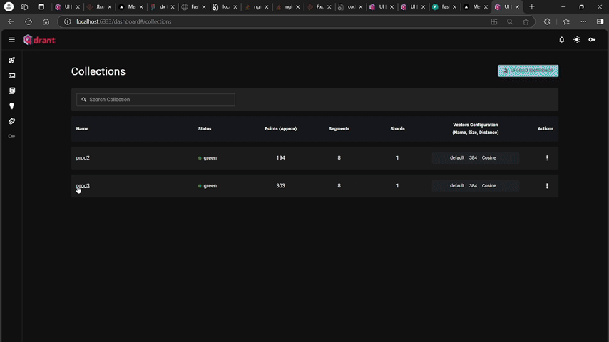
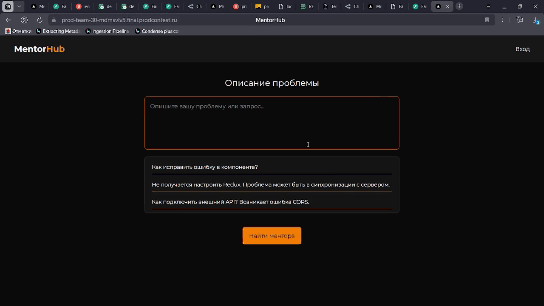
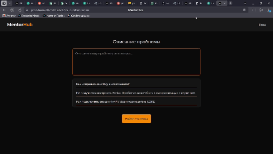

<h1 align="center"> <b>🦆 Mentor Hub 🦆</b></h1>
<p align="center">Сервис для поиска ментора для студентов</p>

<div align="center">
  
</div>

<div align="center">
  <h3>Основные ссылки</h3>
  <p>
    <a href="https://prod-team-30-mdmsvlv5.final.prodcontest.ru" target="_blank"><b>🌐 Перейти к сервису</b></a> •
    <a href="https://prod-team-30-mdmsvlv5.final.prodcontest.ru/api/docs" target="_blank"><b>📚 Документация</b></a> •
    <a href="https://prod-team-30-qdrant-mdmsvlv5.final.prodcontest.ru/dashboard" target="_blank"><b>📊 Qdrant Дашборд</b></a> •
    <a href="https://t.me/prod_final_telegram_bot" target="_blank"><b>Простой телеграм бот</b></a>
  </p>
</div>

<hr>

<div align="center">
  <h2>Документация проекта</h2>
  
  <div>
    <h3>Backend</h3>
    <p>
      <a href="./backend/README.md#архитектурная-документация">📐 Архитектурная документация</a> •
      <a href="./backend/README.md#cicd-конфигурация">⚙️ CI/CD конфигурация</a> •
      <a href="./backend/README.md#api-документация">🔌 API-документация</a> •
      <a href="./backend/tests/README.md">🧪 Тесты</a>
    </p>
  </div>
  
  <div>
    <h3>Frontend</h3>
    <p>
      <a href="./frontend/README.md#frontend-модуль">🖼️ Приложение (скриншоты, журналы, etc.)</a>
    </p>
  </div>

  <div>
    <h3>Telegram Bot</h3>
    <p>
      <a href="./telegram-bot/README.md">🖼️ Телеграм бот.</a>
    </p>
  </div>

</div>


# Оглавление
- [Основные фичи проекта](#основные-фичи-проекта)
- [Запуск приложения](#запуск-приложения)
- [Деплой приложения](#cicd---деплой-приложения)
- [Архитектура проекта](#основная-архитектура-проекта)
- [Взаимодействие сервисов](#взаимодействие-сервисов)


## Основные фичи проекта
#### **Наличие админки [>> DEMO](#админская-панель-со-статистикой)**
- Возможность просмотреть основную статистику в одном месте
- Возможность посмотреть статистику от лица ментора

#### **Точный поиск на основе эмбеддингов [>> DEMO](#получение-ментора-студентом)**
- Поиск выполняется не на основе ключевых слов, а на основе векторов, представляющих предложения
- Вектора дополнительно взвешиваются с коэффициентами для акцентирования внимания на чём-то определенном
- Возможность определить threshold для выдачи результатов (по умолчанию 0.3)

#### **Наличие админской панели векторного хранилища Qdrant [>> DEMO](#дашборд-qdrant)**
- Можно посмотреть числовые связи между различными менторами и запросами
- Можно добавить своих менторов для поиска или вовсе удалить их из выдачи
- Можно посмотреть, какие вектора хранятся в хранилище с метадатой и их параметрами
- Возможность создавать, удалять и делать другие манипуляции с выдачей
- Ссылка на дашборд [>> Link](https://prod-team-30-qdrant-mdmsvlv5.final.prodcontest.ru/dashboard#/collections)

#### **Рейтинг менторов [>> DEMO](#рейтинг-менторов-в-системе)**
- У каждого ментора есть свой рейтинг, который могут просматривать клиенты при выборе
- Клиенты могут добавлять рейтинг от 0 до 10

#### **Управление заявками [>> DEMO](#принятие-заявок-ментором)**
- Возможность принимать/отклонять заявки ментору
- Обмеен контактами telegram при принятии заявки

#### **Календари [>> DEMO](#скачивание-календаря-и-добавление-в-календарь)**
- Возможность скачать файл, который автоматически добавит событие в ваш календарь
- Можно менять дату подачи заявки 

#### **Масштабируемость [>> DEMO](/backend/README.md)**
- Наличие хорошей документации Swagger, OpenAPI
- Продуманная модульная архитектура
- Масштабируемость как для Backend, так и для Frontend
- Удобная настройка через docker-compose и pydantic-settings

#### **Телеграм бот [>> DEMO](/telegram-bot/README.md#демонстрация)**
- Простенький телеграм бот для получения менторов с их параметрами
- Интеграция с API и поисковой векторной системой


## Запуск приложения

```bash
# Склонируйте репозиторий себе на компьютер
git clone https://gitlab.prodcontest.ru/team-30/mentor-hub.git 

# Перейдите в рабочую дидекторию
сd ./mentor-hub

# Запускаем сборку контейнера
docker compose up -d --build 
```
Сборка занимает ~3 минуты с учётом, что необходимо скачать контейнер Ollama и установить в неё embedding-модель.
- Демо развёртывания приложения [**[GIF Демо](./backend/README.md#демонстрация-запуска)**]
- Демо тестирования приложения [**[GIF Демо](./backend/tests/README.md#демо-тестов)**]

## Основная архитектура проекта
```
mentor-hub/
├── .gitignore               # Игнорируемые Git файлы/директории
├── .gitlab-ci.yml           # CI/CD конфигурация для GitLab
├── docker-compose.yaml      # Определение многосервисного окружения
├── README.md                # Описание проекта
│
├── backend/                 # Серверная часть
│   ├── Dockerfile           # Инструкция сборки образа backend
│   ├── requirements.txt     # Зависимости backend
│   ├── app/                 # Исходный код приложения
│   │   ├── main.py          # Точка входа
│   │   ├── common/          # Общие модули 
│   │   ├── core/            # Базовые компоненты (конфигурация, БД, кэш)
│   │   └── src/             # Бизнес-логика и модули приложения
│   └── tests/               # Тесты
│       └── unit_tests/      # Модульные тесты и фикстуры
│
├── frontend/                # Клиентская часть
│   ├── Dockerfile           # Инструкция сборки образа frontend
│   ├── package.json         # Зависимости и настройки сборки
│   └── app/                 # Исходный код интерфейса 
│
└── nginx/                   # Конфигурация веб-сервера Nginx
    ├── Dockerfile           # Инструкция сборки образа Nginx
    ├── nginx.conf           # Основной конфигурационный файл
    └── certs/               # SSL-сертификаты
```

Приложение является модульным, backend и frontend запускаются при помощи `docker-compose.yaml` автоматически и не нуждаются в том, чтобы запускать их раздельно.

## Обоснование выбранных технологий

| Технология     | Описание                     | Преимущества   | Профессиональный опыт  |
|-------------|-----------------------------|----------------|------------------------|
| **FastAPI**  | Основной фреймворк бэкенда | Высокая производительность<br>Встроенная поддержка асинхронности<br>Автоматическая документация API<br>Строгая типизация | Использовал для создания быстрых API-сервисов |
| **PostgreSQL** | Основная база данных | Надежность<br>Поддержка сложных запросов<br>Работа с JSON данными<br>Встроенный поиск по тексту | Применял для хранения и обработки структурированных данных проектов |
| **Redis** | Быстрое хранилище данных | Быстрое кеширование<br>Создание очередей задач<br>Снижение нагрузки на основную БД<br>Обмен сообщениями | Внедрял для ускорения доступа к данным и организации очередей задач |
| **Pytest** | Инструмент для тестирования | Удобное написание тестов<br>Гибкая система фикстур<br>Параметризация тестов<br>Работа с CI/CD | Применял для тестирования кода и автоматизации проверок |
| **Qdrant** | Векторная база данных | Поиск похожих векторов<br>Оптимизация для ML-моделей<br>Масштабируемость<br>Семантический поиск | Использовал для систем рекомендаций и умного поиска на основе ML-моделей |
| **Next.js** | Фронтенд-фреймворк | Серверный рендеринг<br>Статическая генерация страниц<br>SEO-оптимизация<br>Быстрая маршрутизация | Создавал на нём современные веб-приложения с хорошей SEO-оптимизацией |
| **Nginx** | Веб-сервер и прокси-сервер | Высокая производительность<br>Низкое потребление ресурсов<br>Обработка тысяч одновременных соединений<br>Гибкая настройка маршрутизации<br>Балансировка нагрузки | Применял для маршрутизации запросов, настройки SSL, балансировки нагрузки и организации обратного прокси для микросервисов |

## Демонстрация работы приложения

#### Дашборд Qdrant


#### Регистрация ментора


#### Регистрация студента


#### Получение ментора студентом


#### Принятие заявок ментором


#### Админская панель со статистикой


#### Скачивание календаря и добавление в календарь


#### Рейтинг менторов в системе


#### Телеграм бот
