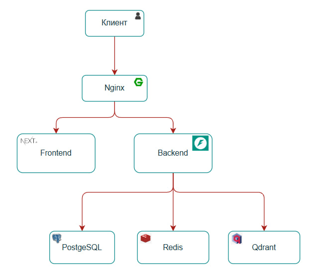
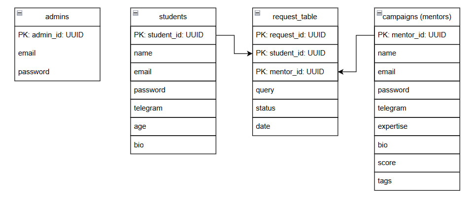
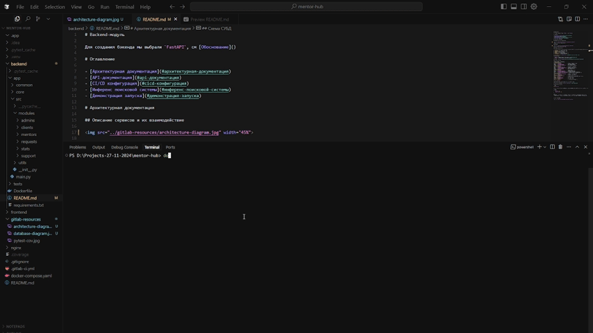

# Backend-модуль

Для создания бэкенда мы выбрали `FastAPI`, см [Обоснование](/README.md#обоснование-выбранных-технологий)

# Оглавление

- [Backend-модуль](#backend-модуль)
- [Оглавление](#оглавление)
- [Архитектурная документация](#архитектурная-документация)
  - [Описание сервисов и их взаимодействие](#описание-сервисов-и-их-взаимодействие)
  - [Схема СУБД](#схема-субд)
  - [Структура проекта сервисов](#структура-проекта-сервисов)
- [API-документация](#api-документация)
  - [Основные точки входа](#основные-точки-входа)
- [CI/CD конфигурация](#cicd-конфигурация)
- [Демонстрация запуска](#демонстрация-запуска)

# Архитектурная документация

## Описание сервисов и их взаимодействие

Описание сервисов и их взаимодействие.

## Схема СУБД

Здесь представлена диаграмма базы данных.

## Структура проекта сервисов

Проект построен на микросервисной архитектуре с гибридным подходом, включающий 6 контейнеризированных сервисов:

1. **Backend** - сервис бизнес-логики и API
2. **Frontend** - пользовательский интерфейс
3. **Nginx** - веб-сервер и прокси
4. **Redis** - кэширование и pub/sub
5. **Qdrant** - векторная база данных для поиска
6. **PostgreSQL** - реляционная база данных

Архитектура проекта: [Структура проекта](../README.md#основная-архитектура-проекта).

# API-документация

- `OpenAPI` доступен по следующей ссылке [OpenAPI](../backend/openapi.json)
- `Swagger UI` доступен на нашем сервере по пути /api/docs

[Ссылка на Swagger](https://prod-team-30-mdmsvlv5.final.prodcontest.ru/api/docs)

## Основные точки входа

| Method | Endpoint | Description |
|--------|----------|-------------|
| **Student Endpoints**                         |
| GET    | `/api/students`                  | Получение студента по токену |
| POST   | `/api/students/sign-up`          | Регистрация студента |
| POST   | `/api/students/sign-in`          | Вход в аккаунт студента |
| PATCH  | `/api/students/{student_id}`     | Обновление данных студента |
| **Mentor Endpoints** |
| GET    | `/api/mentors`                   | Поиск менторов по запросу |
| GET    | `/api/mentors/{mentor_id}`       | Получение ментора по ID |
| POST   | `/api/mentors/{mentor_id}/score` | Изменение рейтинга ментора |
| POST   | `/api/mentors/sign-up`           | Регистрация ментора |
| POST   | `/api/mentors/sign-in`           | Вход в аккаунт ментора |
| **Request Endpoints** |
| POST   | `/api/request`                   | Создание заявки |
| GET    | `/api/request/{request_id}`      | Получение заявки по ID |
| PATCH  | `/api/request/{request_id}`      | Изменение заявки по ID |
| GET    | `/api/request/student/{student_id}` | Получение всех заявок студента по ID |
| GET    | `/api/request/mentor/{mentor_id}` | Получение всех заявок отправленных ментору |
| **Role Endpoints** |
| GET    | `/api/get-role/{instance_id}`    | Получение роли объекта по ID |
| GET    | `/api/get-role`                  | Получение роли по токену |
| **Statistics Endpoints** |
| GET    | `/api/stats/{mentor_id}`         | Получение статистики по ментору |
| GET    | `/api/stats`                     | Получение админской статистики по всему серверу |
| **Admin Endpoints** |
| POST   | `/api/admin/sign-up`             | Регистрация админа |
| POST   | `/api/admin/sign-in`             | Авторизация админа |
| **System Endpoints** |
| GET    | `/api/ping`                      | Проверка на работоспособность |

# CI/CD конфигурация

Нами был настроен автоматический деплой на сервер при push в master.

Ссылка на ci/cd конфигурацию: [Ссылка на конфигурацию](../.gitlab-ci.yml)

# Демонстрация запуска

