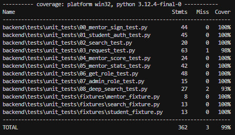
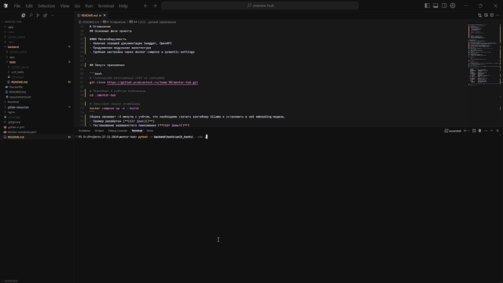

# Тестирование сервиса

Для тестирования мы выбрали тестирование с помощью фреймворка `pytest` см. [Обоснование](/README.md#обоснование-выбранных-технологий). Было заготовлено более 25 тестов для отладки системы.

# Оглавление
- [Тестовые сценарии](#тестовые-сценарии)
- [Отчёт о покрытии тестами](#отчёт-о-покрытии-тестами)
- [Воспроизведение результата](#воспроизведение-результата)


## Тестовые сценарии

- [Ссылка на папку с тестами](/backend/tests/unit_tests/)

В папке `backend/tests/unit_tests/` описаны все тестовые сценарии для системы.

## Отчёт о покрытии тестами



По результатам тестирования нам удалось добиться покрытия тестами в 99%, см. картинка.

## Воспроизведение результата

```bash
# Создание локального python-окружения
# В корне проекта

python -m venv .venv

# Активируем окружение
.venv/bin/activate

# Устанавливаем библиотеки
pip install requests pytest-cov

# Запуск тестов
pytest -v backend\tests\unit_tests\ --cov .
```
Для воспроизведения результата можно запустить следующий `bash-скрипт`.
Затем в терминале будет выведен результат тестирования. `~99%`.

## Демо тестов

